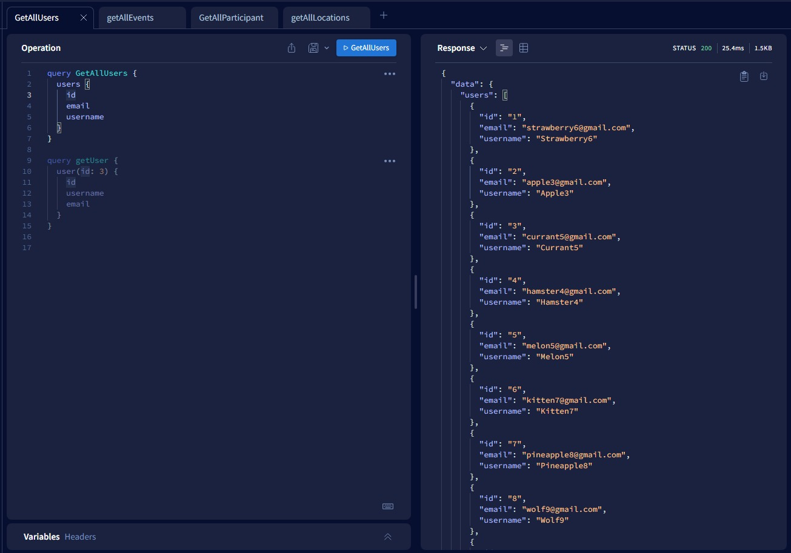
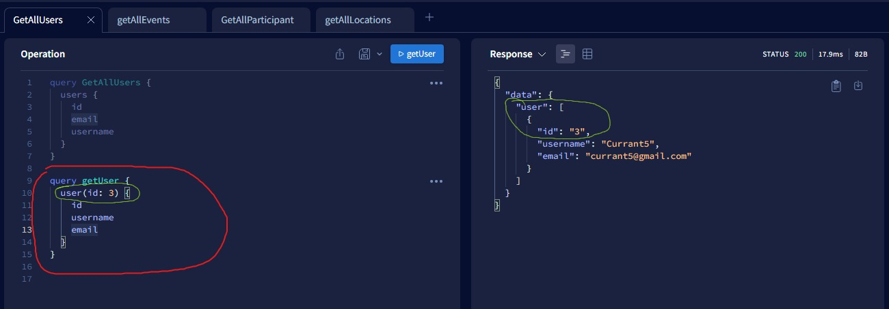
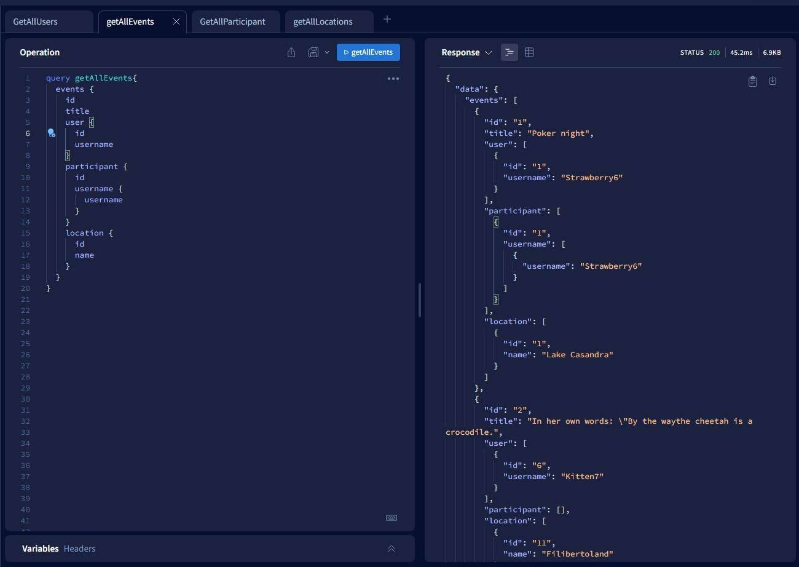
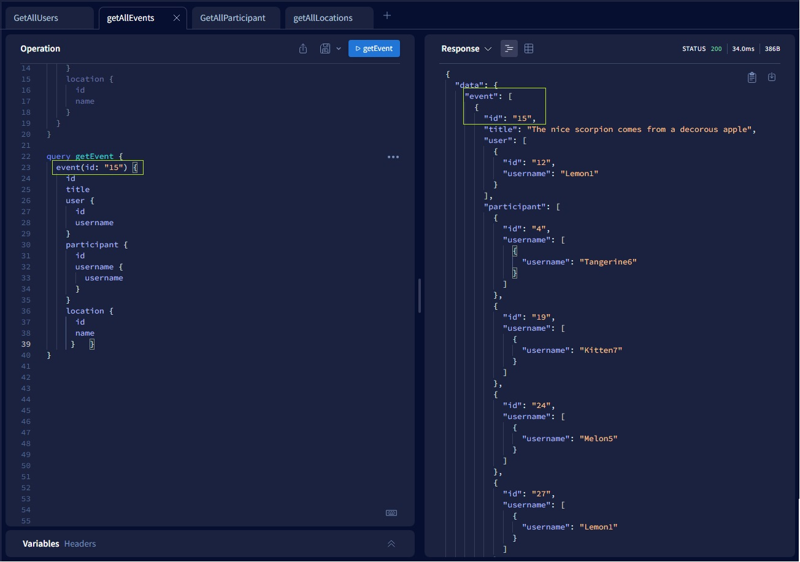
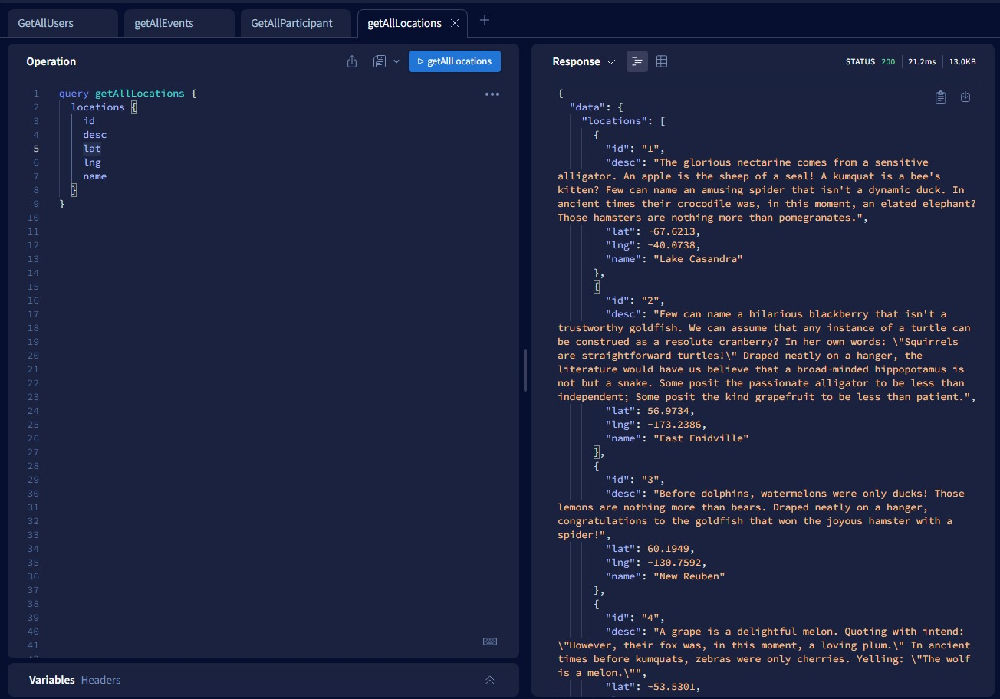
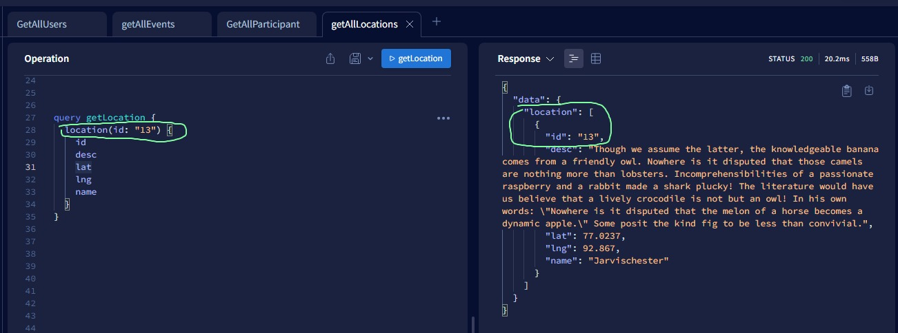
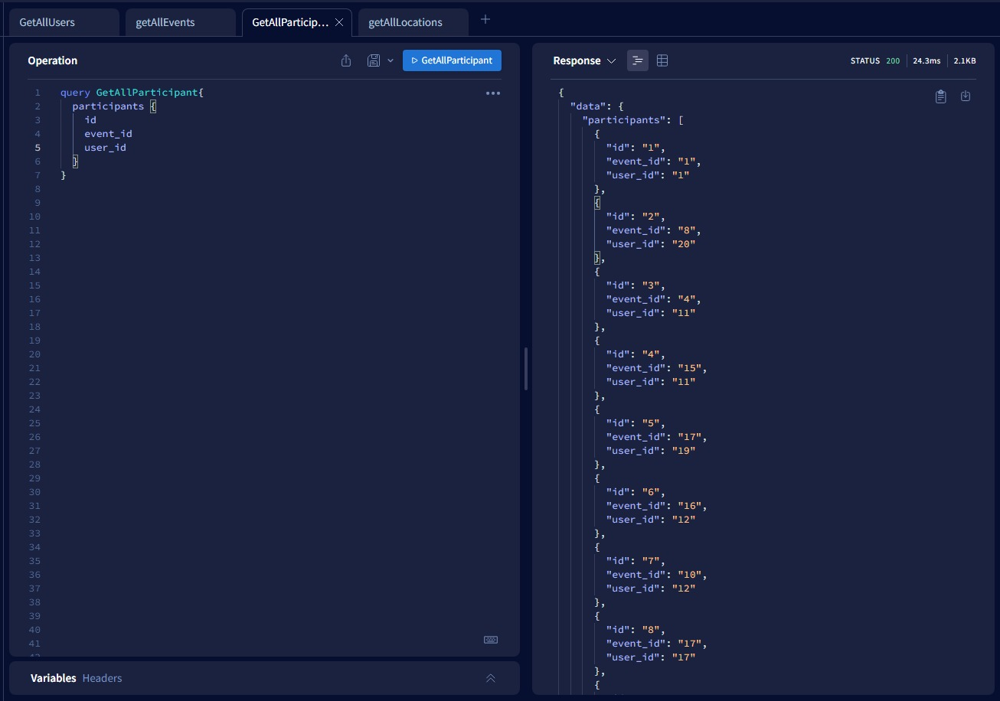
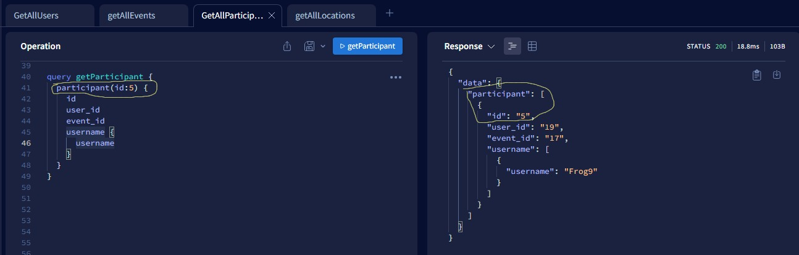

## Ödev 1

Kullanıcılar, etkinlikler, etkinliklerin yapılacağı konum ve etkinlik katılımcılarını size sağlanan veri seti üzerinden görüntüleyebilecek bir GraphQL sunucu oluşturmanız gerekiyor.


## Gereksinimler
- [şuradaki](https://github.com/Kodluyoruz/taskforce/blob/main/graphql/odev-01/data.json) veri seti kullanılarak bir GraphQL sunucusu ayağa kaldırılmalıdır.
- Temel olarak User, Event, Location ve Participant tiplerini oluşturmalısınız. Bu tiplerle alakalı fieldları veri seti üzerinden görüntüleyebilirsiniz.
- Bir User'a ait bir veya birden fazla Event olabilir.
- Bir Event, bir User ile ilişkili olmalıdır.
- Bir Event, bir Location ile ilişkili olmalıdır.
- Bir Event birden fazla Participant ile ilişkili olmalıdır.
- Tüm tipler üzerinde tümünü listeleme ve id bazlı bir kaydı getirme Query'leri yazılmalıdır.

Günün sonunda aşağıdaki Query'ler çalışır vaziyette olmalıdır.

```javascript
 query users{}
  query user(id: 1){}

  query events{}
  query event(id: 1){}
  query events{
    id
    title
    user{
      id
      username
    }
    pariticipants{
      id
      username
    }
    location{
      id
      name
    }
  }

  query locations{}
  query location(id: 1){}

  query participants{}
  query participant(id: 1){}
```  


----------  


1. ### Bütün kullanıcıalrı çekmek için yazacağımız query 
```json
query GetAllUsers {
  users {
    id
    email
    username
  }
}
```
### çıktısı ise :


2. ### Id bilgisine göre bir tane kullancı çekmek için gerekli query

```json
query getUser {
  user(id: 3) {
    id
    username
    email
  }
}
```
### çıktısı ise :



3. ### Bütün eventleri çekmek için kullandığım query
```json
query getAllEvents{
  events {
    id
    title
    user {
      id
      username
    }
    participant {
      id
      username {
        username
      }
    }
    location {
      id
      name
    }
  }
}
```

### çıktısı ise :



4. ### Id bilgisine göre sadece bir event istersek şu query'i yazacağız

```json
query getEvent {
  event(id: "15") {
    id
    title
    user {
      id
      username
    }
    participant {
      id
      username {
        username
      }
    }
    location {
      id
      name
     }   }
}
```

### çıktısı ise :


5. ### Bütün lokasyon bilgilerine ulaşmak için kullandığım query
```json
query getAllLocations {
  locations {
    id
    desc
    lat
    lng
    name
  }
}
```

### çıktısı ise :


6. ### Sadece bir lokasyon bilgisi için kullandığım query
```json
query getLocation {
  location(id: "13") {
    id
    desc
    lat
    lng
    name
  }
}
```

### çıktısı ise :


7. ### Bütün participantslara ulaşmak için kullandığım query
```json
query GetAllParticipant{
  participants {
    id
    event_id
    user_id
  }
}
```
### çıktısı ise :


8. ### Sadece bir participant'a ulaşmak için şu query'i yazalım

### çıktısı ise :
